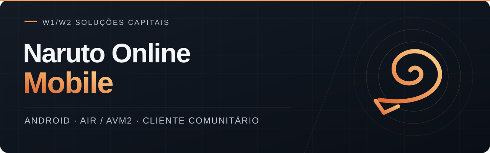
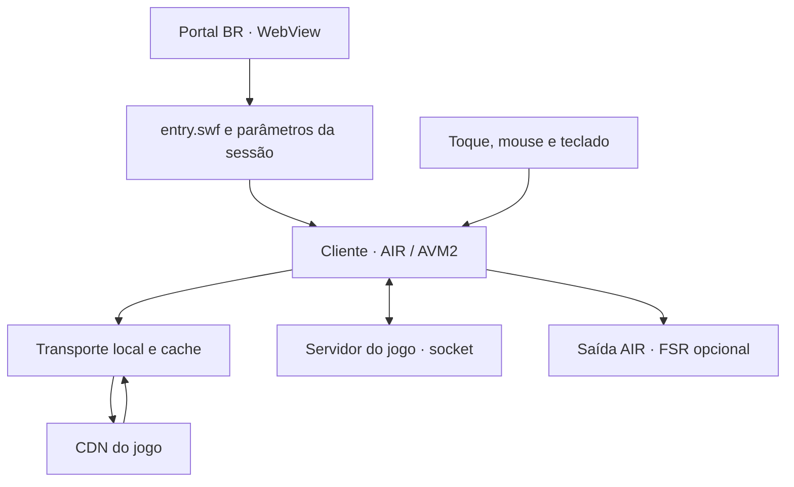

<div align="center">



# Naruto Online Mobile

**O cliente Flash de Naruto Online BR, executado no seu Android.**

Login pelo portal, jogo no runtime AIR e controles pensados para a tela do celular.

**1.3.17** · Android **7.0+** · **ARM64** · Camada própria sob **MIT**

[Começar](#começar) · [Controles](#controles) · [Gráficos](#gráficos-e-desempenho) · [Desenvolvimento](#desenvolvimento) · [Suporte](#suporte)

</div>

---

## O projeto

Naruto Online Mobile reúne o portal brasileiro do jogo e uma camada de execução AIR em um aplicativo Android. Você entra na sua conta, escolhe o servidor e abre o cliente real. O SWF roda no aparelho; conta, personagens e progresso continuam nos serviços utilizados pelo jogo.

O trabalho deste repositório está na adaptação: fazer o cliente encontrar seus recursos, conservar a sessão, receber toques e teclado, carregar os módulos e encerrar cada sessão corretamente. O APK incorpora o runtime, então a instalação dispensa um plugin Flash separado.

O projeto é mantido por **W1/W2 Soluções Capitais**. A camada própria tem código público e licença MIT. O cliente do jogo, o runtime AIR e os recursos de terceiros conservam seus direitos e condições de uso.

> **Estado atual:** versão experimental, com funcionamento relatado durante o desenvolvimento. A base 1.3.17 passou pelas verificações de código e empacotamento descritas aqui. A reprodução de áudio dessa versão e o desempenho em diferentes celulares ainda precisam de confirmação no aparelho.

### O que você encontra no aplicativo

| Área | Recursos |
| --- | --- |
| Acesso | Portal BR, sessão salva, escolha manual de servidor e troca de conta |
| Jogo | Cliente SWF/AVM2 executado no Android com AIR incorporado |
| Entrada | Toque, mouse virtual, arrasto, teclado e atalhos Enter/Esc/Tab |
| Interface | Botão CONTROLES arrastável e contador de FPS reposicionável |
| Imagem | Perfil de contraste, escala interna e FSR 1 opcional |
| Cadência | Meta de 60 FPS; 90, 120 e máxima da tela por escolha |
| Áudio | Saída de mídia, SOM ON/OFF persistido e teste local de som |
| Kaguya | Subconjunto cosmético: estilos, retratos e efeitos de áudio |
| Sessão | Reinício, retorno aos servidores e acesso à recarga oficial |

### Nesta versão: 1.3.17

A atualização corrige a adaptação dos tipos de áudio. `Sound` permanece nativo nas superclasses, assinaturas e conversões usadas pelos sons embutidos. A resolução de caminhos externos atua somente nas construções estáticas reconhecidas de `new Sound(...)`.

Os **15 SWFs de áudio do Kaguya atravessam o adaptador sem alteração de bytes**. A verificação independente também cobre construções externas, casts, desvios, switches e handlers. Ao voltar do segundo plano, o aplicativo reaplica o estado de áudio escolhido.

Os recursos anteriores de portal, controles, cache e renderização continuam na base. O FSR permanece opcional e desligado a cada abertura.

<details>
<summary><strong>Guia de leitura</strong></summary>

- **Para jogar:** [Começar](#começar), [Requisitos](#requisitos), [Controles](#controles) e [Áudio](#áudio).
- **Para configurar:** [Gráficos e desempenho](#gráficos-e-desempenho), [FSR, DLSS e Magpie](#fsr-dlss-e-magpie) e [Kaguya](#kaguya).
- **Para entender o aplicativo:** [Arquitetura](#arquitetura), [Rede e cache](#rede-e-cache) e [Contas e recarga](#contas-e-recarga).
- **Para desenvolver:** [Código público](#código-público), [Desenvolvimento](#desenvolvimento), [Validação](#validação) e [Contribuir](#contribuir).
- **Para resolver uma falha:** [Diagnóstico](#diagnóstico), [Privacidade](#privacidade-e-permissões) e [Suporte](#suporte).

</details>

## Começar

Use o APK fornecido pelo mantenedor. Confira os requisitos abaixo e siga o fluxo do aplicativo:

1. **Instale o APK.** A atualização sobre uma versão existente exige o mesmo certificado de assinatura.
2. **Abra em paisagem e faça login.** A conta salva pode continuar autenticada entre aberturas.
3. **Escolha o servidor.** Aguarde o carregamento dos módulos e recursos do cliente.
4. **Abra CONTROLES.** Arraste o botão para um lugar confortável e ajuste mouse, teclado e contador.
5. **Comece com 60 FPS e FSR desligado.** Só mude uma opção por vez ao comparar a imagem e a fluidez.
6. **Confira o áudio.** Use SOM: ON, ajuste o volume de mídia do Android e veja as categorias de música e efeitos nas configurações do jogo.

O acesso depende de internet, uma conta válida e disponibilidade do portal, CDN e servidor. O cache ajuda na reabertura de recursos, mas não oferece uma sessão offline.

<details>
<summary><strong>Identificação do APK 1.3.17</strong></summary>

| Campo | Valor |
| --- | --- |
| Arquivo | `NarutoOnline_RealmeC71_1.3.17.apk` |
| Pacote Android | `air.br.davi.narutoair.c71r2` |
| versionCode | `1003017` |
| Tamanho do arquivo | 12.767.250 bytes — aproximadamente 12,18 MiB |
| Arquitetura | `arm64-v8a` |
| Assinatura verificada | APK Signature Scheme v2 |

**SHA-256 do APK**

```text
a3c0eed5f3865695e6af0130b4e26aceaad26bb3168dab11c94196fa572955c9
```

**SHA-256 do certificado**

```text
1b4b528b92aa1ea13753798cbb701d66589333f7b2d8afb3a750aa1c83642c29
```

Esses valores pertencem ao arquivo gerado desta versão. Uma compilação diferente terá outro hash; uma chave diferente também mudará o certificado. O APK é distribuído separadamente do código deste repositório.

</details>

## Requisitos

| Item | Requisito da distribuição atual |
| --- | --- |
| Android | **7.0 ou superior**, API 24+ |
| Sistema e processador | **ARM64**, com Android de 64 bits |
| Portal | WebView funcional, com JavaScript e cookies |
| Conexão | Acesso ao portal, autenticação, CDN e servidor do jogo |
| Conta | Conta válida aceita pelo portal |
| Renderização | Compatibilidade com AIR mobile e os drivers utilizados |
| Tela | Uso em paisagem |
| Armazenamento | Espaço para APK, instalação do runtime e dados/cache da sessão |

O alvo declarado no manifesto é API 35. O mínimo de instalação continua sendo API 24: `targetSdkVersion` e `minSdkVersion` têm funções diferentes.

**Um processador ARM64 com Android de 32 bits não atende ao requisito.** Esta distribuição não inclui ARMv7, x86 ou x86_64. O nome `RealmeC71` nos arquivos vem do desenvolvimento e não limita o aplicativo a esse modelo.

### Memória e desempenho

Ainda não há uma matriz de aparelhos que permita indicar um mínimo confiável de RAM, CPU ou GPU. A quantidade de memória disponível, o driver, a resolução, a temperatura e a cena carregada alteram o resultado. O tamanho de 12,18 MiB do APK também não representa a ocupação total depois da instalação.

O cache estático próprio pode ocupar até **64 MiB**. WebView, texturas, objetos SWF e outros dados da sessão têm consumo separado.

### FSR opcional

O caminho FSR exige **OpenGL ES 3.0** e EGL14 compatíveis. A integração limita a saída a **8.388.608 pixels** e respeita o tamanho máximo de textura informado pela GPU. Se a saída experimental não iniciar ou perder as condições necessárias, o aplicativo retorna ao caminho AIR.

### Compatibilidade conhecida

| Plataforma | Situação |
| --- | --- |
| Android usado durante o desenvolvimento | Entrada no jogo e controles relatados pelo usuário; sem benchmark completo |
| Outros Android ARM64 / API 24+ | Atendem às restrições do pacote; precisam de verificação de funcionamento |
| Android abaixo de 7.0 ou sistema ARM de 32 bits | Fora dos requisitos deste APK |
| Emuladores x86/x86_64 | Sem distribuição específica; tradução ARM não validada |
| iPhone e iPad | Sem versão neste projeto |
| Windows | Magpie e o pacote Kaguya original usam outro caminho de execução |

## Controles

O painel **CONTROLES** concentra a entrada e os ajustes do aplicativo. Seu botão pode ser arrastado; a posição fica salva.

| Comando | Uso |
| --- | --- |
| **MOUSE** | Ativa o cursor e o touchpad virtual |
| **SEGURAR** | Mantém o botão pressionado para arrastar |
| **CLIQUE** | Mostra uma marca visual no ponto do toque/clique |
| **TECLADO** | Abre a entrada Android para o campo selecionado |
| **ENTER / ESC / TAB** | Envia o atalho correspondente ao cliente |
| **REINICIAR / SERVIDORES** | Encerra o cliente atual e retorna ao fluxo de acesso |
| **TROCAR CONTA** | Inicia o fluxo de troca sem conservar o cliente anterior |
| **IMAGEM / FPS** | Abre meta de FPS, FSR, contador e opções Kaguya |
| **SOM / TESTAR SOM** | Controla o volume do aplicativo e testa a saída local |
| **RECARGA OFICIAL** | Abre a página oficial da sessão atual |

Para digitar, toque primeiro no campo do jogo e depois use TECLADO. O foco precisa estar no campo certo para receber o texto ou os atalhos.

O contador pode ficar em qualquer canto ou ser ocultado. Os controles pertencem à interface do aplicativo; não exigem uma janela flutuante sobre outros apps. Os botões LOG/DIAG foram retirados da interface de produção.

## Gráficos e desempenho

### 60 FPS como padrão

O perfil solicita **60 FPS** ao Stage. As opções de **90**, **120** e **máxima da tela** dependem de escolha explícita. A preferência define a cadência pedida ao runtime; CPU, GPU, tela e custo da cena determinam o resultado.

| Medida | O que representa |
| --- | --- |
| Meta de FPS | Cadência solicitada ao Stage |
| Contador AIR | Frequência observada dos eventos `ENTER_FRAME` |
| Swap/saída FSR | Apresentações feitas pelo caminho gráfico experimental |

O HUD ajuda a comparar sessões, mas não conta necessariamente imagens visuais diferentes apresentadas na tela. Para medir fluidez e quedas, também é preciso observar frame time e apresentação no Android.

### A sensação de velocidade em 2×

Parte do cliente Flash pode avançar por frame script. Ao passar de uma cadência próxima de 30 para 60, essas animações podem acelerar. A lógica e a apresentação ainda não foram separadas de forma geral nesta adaptação.

Essa aceleração pode aparecer mesmo quando não há interpolação de imagem. Uma futura correção de velocidade precisa considerar relógios, temporizadores e animações do cliente, preservando a comunicação com o servidor.

### Perfil de imagem

O perfil utiliza qualidade AIR `medium`, contraste moderado e tenta aplicar **80% da largura e da altura internas**, com ampliação da saída. Quando essa escala funciona, a superfície contém cerca de **64% dos pixels** da resolução inteira.

A redução pode aliviar o custo de renderização, mas não corresponde a um ganho automático de 36% em FPS. O carregamento, a execução AVM2, o áudio e a composição continuam consumindo recursos. As coordenadas de toque acompanham a superfície efetivamente aplicada.

### Carregamento com menos pressão

A fila de SWFs utiliza dois downloads simultâneos e importa um módulo por `ENTER_FRAME`. Um frame acima do orçamento pode adiar a importação por um intervalo limitado. A marca de **8 MiB** na fila de bytes reduz a abertura de novas cargas, e o processamento pausa no segundo plano.

Essa marca é um controle de pressão, não um limite absoluto de RAM. Downloads já iniciados podem terminar depois dela, e a importação nativa de um SWF ainda pode ocupar um frame inteiro. Cenas pesadas continuam exigindo medição no aparelho.

## FSR, DLSS e Magpie

### A integração disponível

O aplicativo possui **AMD FidelityFX Super Resolution 1**, experimental e opcional. Os kernels FP32 foram adaptados para **OpenGL ES 3.0**, com dois passes espaciais:

| Passe | Função |
| --- | --- |
| **EASU** | Reconstrução/ampliação da imagem de menor resolução, considerando bordas |
| **RCAS** | Nitidez adaptativa sobre a imagem ampliada |

O hook entra antes do swap EGL14 do AIR. A integração copia o framebuffer na GPU, executa os passes e apresenta a saída em outra Surface no contexto previsto. O caminho de produção usa operações GPU e não depende de capturas por `glReadPixels`.

O renderer guarda e restaura estado GL/EGL, libera a saída ao voltar ao portal, abrir a recarga ou pausar e conserva um caminho de retorno à renderização AIR. O FSR começa **desligado a cada abertura**, sem tornar sua ativação um requisito para entrar no jogo.

### Geração de quadros

FSR 1 trabalha sobre a imagem existente. A integração atual **não gera quadros intermediários** e não recebe um pipeline geral de profundidade, vetores de movimento ou separação de HUD do cliente Flash.

Uma implementação temporal ou de frame generation exigiria histórico, sincronização, tratamento de artefatos e medidas de latência e custo. Aumentar o contador, repetir o framebuffer ou acelerar frame scripts não resolve essas exigências.

**DLSS não está integrado.** A ponte AIR Android não possui uma biblioteca DLSS executável para esse caminho. **Magpie** é um projeto de Windows; suas referências servem como estudo de filtros e apresentação, sem um componente Magpie incorporado ao APK.

### O que já foi medido

Os shaders foram compilados e executados em **Mesa llvmpipe**, incluindo amostragem, cores, orientação e cópia GPU. Esse resultado verifica operações naquele ambiente de software. Ainda não há benchmark publicado do FSR deste aplicativo em Adreno, Mali ou outra GPU Android.

Os passes e a composição têm custo. Se o FSR piorar a fluidez ou a imagem, desligue a opção e compare com a saída AIR nas mesmas condições.

[Proveniência](fsr/PROVENANCE.json) · [Licença AMD](fsr/NOTICE.txt) · [Estado da geração de quadros](FRAME_GENERATION_STATUS.md) · [Referências Magpie](MAGPIE_STATUS.md)

## Kaguya

O port utiliza parte dos recursos do pacote `Naruto_Kaguya_Remaster_Portable.zip` recebido durante o desenvolvimento. As instruções originais indicam **Herrington Kaguya** como autor. Os executáveis Windows do pacote não são executados nem incluídos na adaptação Android.

| Conteúdo | Subconjunto integrado |
| --- | --- |
| Estilos | Vento, Fogo, Raio, Água e Terra |
| Retratos | 10 PNGs: dois por estilo, nas dimensões 176×68 e 45×45 |
| Mapeamento | IDs `10000101` a `10000501`, aparência `1`, em caminhos reconhecidos |
| Efeitos de áudio | 15 SWFs com exportação `s1` |
| Preferências | Ativação e estilo salvos |
| Recursos restantes | Retorno ao transporte oficial |

Os sons atendidos são `s1754`, `s1790`, `s1791`, `s1792`, `s17661` a `s17670` e `s17676`. Cada substituição usa o nome que o próprio cliente solicita. O manifesto registra origem e SHA-256 dos arquivos.

O mod é cosmético. Escolher um estilo no painel não troca a classe, os atributos ou o inventário mantidos pelo servidor.

### Alcance do material recebido

As pastas grandes **BGM** e **Animation effect** já estavam ausentes no pacote usado como origem. O subconjunto Android, portanto, não inclui uma trilha Kaguya completa nem todas as interfaces, personagens e animações do remaster Windows.

O repositório contém roteamento, controles, testes e manifesto. Os **25 arquivos de mídia** são dependências separadas e não foram republicados aqui. Para testar ou empacotar esse conteúdo, é necessária uma cópia autorizada nos caminhos previstos.

As instruções do pacote original indicam gratuidade e proíbem obter benefícios com o software. A licença MIT da camada mobile não muda essas condições.

[Detalhes do port](KAGUYA_STATUS.md) · [Manifesto](mods/kaguya/manifest.json) · [Direitos de terceiros](THIRD_PARTY_NOTICES.md)

## Áudio

Os sons embutidos precisam conservar a ligação entre os dados `DefineSound`, a exportação `SymbolClass` e a classe Sound do runtime. A **1.3.17 preserva essa ligação** e mantém `Sound` nativo nos tipos, casts e superclasses.

`BrowserSound` resolve as URLs de construções externas estáticas reconhecidas. Continua sendo uma subclasse do Sound nativo e conserva canais, posição, repetições, `SoundTransform` e eventos. Expressões dinâmicas ou ambíguas permanecem no caminho nativo.

Quando um novo índice de bytecode amplia um operando, o adaptador recalcula os desvios, switches e limites dos handlers. A fixture de áudio e o parser independente verificam esse resultado. Os 15 SWFs Kaguya também são comparados byte a byte antes e depois da adaptação.

### Conferir a saída no celular

1. Ative **SOM: ON** no painel.
2. Confira o **volume de mídia** do Android e a saída de áudio selecionada.
3. Use **TESTAR SOM**. Ele envia um tom PCM curto, baixo, sem depender de rede ou do mod.
4. Confira música e efeitos nas configurações internas do jogo.

O aplicativo salva SOM ON/OFF, reaplica o estado ao retornar do segundo plano e encerra os canais ao abandonar o cliente. O teste local ajuda a separar problemas de saída de mídia daqueles ligados a recursos ou categorias do jogo.

Os MP3 analisados foram decodificados para PCM não silencioso. A integridade dos arquivos e a adaptação foram verificadas; **a reprodução final da 1.3.17 em Android ainda não foi confirmada nesta validação**.

## Arquitetura

A WebView cuida do portal. O AIR executa o cliente. Entre eles, a camada própria transporta os parâmetros de lançamento e adapta recursos e entrada para o ambiente mobile.



### Lançamento

A ponte identifica a URL versionada real de `entry.swf` e conserva FlashVars e parâmetros de URL. O popup usado pelo portal para abrir o servidor faz parte desse fluxo.

Uma entrada genérica `/entry.swf` ainda não identifica o diretório correto do cliente. Da mesma forma, a URL dinâmica `app:/.../[[DYNAMIC]]/...` criada por `loadBytes` não serve de base para encontrar arquivos no CDN.

### Adaptação de SWF e ABC

`EntryCompatibility` examina o SWF e encaminha referências específicas de navegador para os adaptadores próprios. Essa camada cobre Security, Loader, URLLoader, URLStream, ExternalInterface, Socket e a verificação de suporte ao menu desktop.

`SoundConstructorCompatibility` trata apenas as construções externas reconhecidas de Sound. Os tipos e símbolos de áudio embutido permanecem nativos.

O cliente é importado por `loadBytes` com o contexto e a permissão de código configurados. Uma inicialização de SWF pode ocorrer antes de terminar o download de configurações, texturas e dados de jogo.

### Encerramento e retomada

Trocar conta ou servidor encerra o cliente anterior: downloads, sockets, áudio, callbacks e objetos montados no Stage são descartados. Eventos atrasados da sessão antiga precisam permanecer sem efeito sobre a sessão nova.

Na retomada, a saída gráfica, o foco e a fila de importação são reavaliados. A existência de uma Surface antes da pausa não garante que ela continue válida depois dela.

## Rede e cache

O transporte HTTP local escuta em **loopback `127.0.0.1`**, com porta escolhida durante a execução. Ele recebe os caminhos do cliente e resolve recursos para o CDN, cache elegível ou substituições locais do mod.

A porta pertence àquela sessão. Não é um endpoint fixo nem um serviço público de proxy. O jogo continua sendo executado no aparelho.

### Regras do cache

| Regra | Valor ou condição |
| --- | --- |
| Orçamento total | 64 MiB |
| Quantidade máxima | 512 arquivos |
| Tamanho por arquivo | Até 8 MiB |
| TTL máximo | Uma hora, limitado pela política de cache |
| Conteúdo candidato | PNG, JPEG e SWF em caminhos versionados |
| Resposta elegível | GET 200, tamanho positivo, tipo e política apropriados |
| Exclusões | Query, Range, Set-Cookie, Vary, private/no-store e compressões não elegíveis |

As substituições Kaguya são avaliadas antes do cache, evitando misturar o mod com arquivos oficiais. O Android pode remover o cache; ele não é uma cópia completa do CDN.

### Comunicação do jogo

`BrowserSocket` conserva os bytes e operações de flush usados pelo cliente. Os diagnósticos podem contar conexão, envio e recebimento sem alterar o protocolo.

Uma conexão aberta, sozinha, não confirma uma resposta útil do servidor. Para investigar um carregamento parado, é preciso relacionar sessão, primeira transmissão, flush, dados recebidos e recurso pendente.

Alguns endpoints legados utilizam HTTP, e o manifesto permite esse tráfego. A comunicação do conjunto não deve ser descrita como HTTPS integral.

## Contas e recarga

### Sessão salva

Cookies e armazenamento do portal podem conservar o login entre aberturas. O acesso usa a conta aceita pelo portal; a seleção de servidor permanece manual.

A troca descarta o cliente já carregado. Assim, callbacks e conexões anteriores não devem reabrir uma sessão antiga durante a nova seleção.

### Recarga oficial

O comando abre o fluxo oficial com os identificadores disponíveis na sessão, incluindo usuário e servidor. O aplicativo não realiza compras automaticamente. Confira a conta e o servidor exibidos na página antes de concluir uma transação.

O checkout e os meios de pagamento não foram certificados nesta validação. A abertura da página é uma etapa distinta da conclusão de uma compra.

### Portal sem resposta ou bloqueado

A camada de acesso classifica bloqueios e desafios no documento principal dos hosts previstos. O recarregamento manual é limitado a uma tentativa por minuto nas condições atendidas; a abertura do portal público no navegador depende de toque.

A recuperação de login também pode fazer uma tentativa limitada após cerca de 45 segundos, conforme o estado da navegação. Esses caminhos auxiliam a retomada local. As regras de acesso, bloqueio e proteção continuam pertencendo ao serviço remoto.

## Privacidade e permissões

| Permissão declarada | Finalidade |
| --- | --- |
| `INTERNET` | Portal, autenticação, recursos e conexão do jogo |
| `ACCESS_NETWORK_STATE` | Consulta da conectividade |

O descritor não solicita contatos, SMS, microfone, acessibilidade, root ou permissão para desenhar sobre outros aplicativos. Também declara `allowBackup=false`, aceleração de hardware e permissão de tráfego HTTP legado.

O aplicativo usa cookies, parâmetros de sessão e preferências locais. O portal e o cliente podem ter serviços, telemetria e políticas próprios. A avaliação de privacidade precisa considerar esses componentes externos e o runtime incorporado.

### Ao compartilhar um diagnóstico

Remova senhas, cookies, tokens, e-mails de conta e parâmetros de autenticação. Revise prints e logs mesmo quando a instrumentação mascara valores conhecidos. Chaves privadas e senhas de assinatura devem permanecer fora do repositório.

### Assinatura e Play Protect

O APK 1.3.17 passou pela verificação de assinatura v2. Isso permite conferir a integridade e o certificado daquele arquivo; não substitui uma auditoria de todos os componentes.

A distribuição fora da Play Store pode exibir avisos sobre desenvolvedor desconhecido. Não há garantia de que mudar nome, ícone ou recompilar retire esses avisos. Confira a origem do APK e a mensagem exibida pelo Android ao avaliar a instalação.

## Código público

A licença MIT cobre a **camada própria publicada**. O repositório permite estudar, revisar e modificar a adaptação mobile, respeitando as atribuições dos componentes externos.

| Componente | Disponibilidade |
| --- | --- |
| Bootstrap e adaptadores ActionScript | Código-fonte público, MIT |
| Transporte, cache e adaptação SWF/ABC | Código-fonte público, MIT |
| Extensões próprias da ponte Android e controles | Código-fonte público, MIT |
| Wrappers GLES e compositor experimental | Código-fonte público, com atribuição AMD quando aplicável |
| Headers e kernels AMD FSR 1 | Publicados com aviso e licença MIT da AMD |
| Scripts, fixtures, stubs e testes próprios | Código-fonte público |
| Ponte histórica `PortalContext` | Fonte original indisponível; dependência de `portal.jar` autorizado |
| AIR SDK e runtime | Dependências externas sob seus termos |
| Cliente SWF, mídia e servidores do jogo | Componentes de terceiros, fora do repositório |
| Kaguya | Manifesto e roteamento publicados; mídia separada |
| Certificado privado e senha | Não publicados |

**O clone público ainda não reconstrói sozinho o APK completo.** O pipeline depende do SDK externo, de recursos separados e da ponte histórica compilada. Os stubs de teste não substituem essa implementação de produção.

Recuperar ou reimplementar a ponte histórica é uma prioridade para tornar o build da camada mobile totalmente reconstruível a partir de fontes públicas.

[Escopo das fontes](SOURCE_STATUS.md) · [Licença](LICENSE) · [Componentes externos](THIRD_PARTY_NOTICES.md)

## Desenvolvimento

### Mapa do repositório

| Caminho | Responsabilidade |
| --- | --- |
| `src/NarutoAir.as` | Bootstrap e coordenação do cliente AIR |
| `src/br/davi/narutoair/compat/` | Loaders, recursos, áudio, socket, entrada e perfil gráfico |
| `bridge-src/` | Integração Android, portal, sessão, marca e superfícies |
| `transport-src/` | Proxy, cache, SWF/ABC e roteamento Kaguya |
| `fsr-src/` | Renderer experimental EASU/RCAS |
| `fsr/upstream/` e `fsr/shaders/` | Entradas AMD e shaders GLES |
| `build-tools/` | Transformações de bytecode e ferramentas auxiliares |
| `wrapper-src/` | Marcador utilizado na geração da extensão |
| `resource-tests/` | Testes de lógica, scripts e shaders |
| `compat-tests/` | Fixtures SWF e verificação independente de bytecode/áudio |
| `bridge-tests/`, `transport-tests/`, `fsr-tests/` | Testes da ponte, transporte e estado gráfico |
| `test-stubs/` | Assinaturas mínimas para compilação/testes |
| `mods/kaguya/manifest.json` | Proveniência dos recursos separados do mod |
| `docs/assets/` | Identidade visual deste README |
| `NarutoAir-app.xml` | Identidade, plataforma, versão e permissões |
| `build.py` e `test.py` | Pipeline de build e suíte principal |

### Ambiente utilizado

| Ferramenta | Papel |
| --- | --- |
| Python 3 | Orquestração e verificações |
| JDK 17 | Compilação e patches; classes próprias com `--release 8` |
| Node.js | Testes `.mjs` |
| AIR SDK 51.1.4.1 | Compiladores AS3, ADT e runtime |
| `android.jar` API 35 | Compilação Android/GLES |
| JPEXS / FFDec | Verificação independente opcional de SWF/ABC |
| FFmpeg | Verificação adicional do áudio analisado |
| Mesa EGL/GLES | Testes de shader fora do Android |

O pipeline modifica bytecode de integração do runtime. Uma mudança de SDK deve passar por nova validação; o resultado depende das versões e entradas utilizadas.

<details>
<summary><strong>Preparar um build completo</strong></summary>

Além do clone, são necessários:

1. **AIR SDK autorizado**, utilizado conforme as condições do fornecedor.
2. **`android.jar` API 35**.
3. **`portal.jar` autorizado**, com as classes históricas esperadas pelo pipeline.
4. **Ícones e marca da distribuição** e os recursos Kaguya previstos pelo empacotamento, obtidos separadamente.
5. **Certificado PKCS#12** e arquivo de senha para assinar a distribuição.

O pipeline atual espera os caminhos de recursos da distribuição e não oferece, por si só, um build alternativo sem essas entradas. Preparar uma distribuição que as omita exige ajustar o empacotamento e os testes correspondentes.

Configure os caminhos no ambiente:

```bash
export AIR_HOME="/caminho/para/air-sdk"
export ANDROID_API_JAR="/caminho/para/android-35/android.jar"
export NARUTO_SIGNING_KEY="/caminho/privado/app.p12"
export NARUTO_SIGNING_PASSWORD_FILE="/caminho/privado/senha.txt"
```

Chave e senha ficam fora da árvore versionada. Uma chave própria gera uma distribuição própria; ela não atualiza diretamente um aplicativo assinado com o certificado do mantenedor.

Com as dependências completas:

```bash
python3 build-tools/build-fsr-shaders.py
python3 test.py
python3 build.py
```

O build compila as classes próprias, aplica os patches, gera SWC/ANE, compila o bootstrap e empacota o APK. As etapas finais inspecionam o DEX e verificam a assinatura.

A classe EGL14 do SDK é alterada temporariamente durante o empacotamento e restaurada no bloco de finalização. Use uma cópia de trabalho do SDK e evite builds simultâneos no mesmo diretório.

Os shaders partem dos headers em `fsr/upstream/`. Confira a proveniência, os hashes de entrada e as alterações geradas; mantenha os avisos AMD no conteúdo derivado.

</details>

<details>
<summary><strong>Testar a lógica sem conta, mod ou chave</strong></summary>

Estes testes utilizam lógica própria e fixtures locais:

```bash
node resource-tests/test-resources.mjs
node resource-tests/test-audio.mjs
node resource-tests/test-launch-parameters.mjs
node resource-tests/test-portal-access.mjs
node resource-tests/test-login-recovery.mjs
node resource-tests/test-load-scheduler.mjs
node resource-tests/test-socket-release.mjs
node resource-tests/test-fps-hud.mjs
node resource-tests/test-fsr-controls.mjs
```

Eles não fazem login real nem exercitam os drivers do celular. A suíte completa `test.py` inclui testes que dependem do SDK, API Android e arquivos Kaguya.

A verificação independente de SWF/ABC pode ser ativada com:

```bash
export FFDEC_JAR="/caminho/para/ffdec_lib.jar"
python3 test.py
```

Essa execução exige também as dependências da suíte principal. A verificação usa JPEXS para conferir o resultado dos adaptadores, incluindo preservação dos tipos Sound e limites de controle de fluxo.

Para executar os testes de shader com Mesa EGL/GLES disponível:

```bash
python3 resource-tests/test-fsr-gpu.py
```

O resultado registra o backend utilizado em `fsr/GPU_VALIDATION.json`. Sem execução em um celular, o campo `android_device_tested` deve continuar `false`.

</details>

<details>
<summary><strong>Conferir um APK gerado</strong></summary>

```bash
sha256sum NarutoOnline_RealmeC71_1.3.17.apk
java -jar "$AIR_HOME/lib/android/lib/apksigner.jar" verify --verbose --print-certs NarutoOnline_RealmeC71_1.3.17.apk
```

Confira também pacote, versionCode, ABI e permissões com as ferramentas Android. Compare o hash somente com o arquivo exato ao qual ele se refere.

</details>

## Validação

| Área | Verificação realizada |
| --- | --- |
| Portal e sessão | Scripts e fixtures de navegação, bloqueio, recuperação e eventos obsoletos |
| Controles | Foco, entrada, coordenadas, arrasto e preferências em modelos de teste |
| Transporte | HTTP, socket, cache, limites, exclusões e retorno aos recursos oficiais |
| SWF/ABC | Fixtures compiladas, idempotência, preservação e leitura independente |
| Áudio 1.3.17 | 15 SWFs Kaguya intactos; seis construções externas, tipos nativos e realocação de controle de fluxo |
| FSR | Shaders em Mesa llvmpipe, restauração de estado GL e hook EGL14 |
| Empacotamento | DEX, bootstrap e recursos conferidos; assinatura v2 validada |

Os testes JVM e Node verificam partes do comportamento com fixtures e modelos. A inspeção do APK confirma o que entrou no pacote. Nenhuma dessas etapas substitui o teste de sessão, som e apresentação em um Android real.

Há relatos de funcionamento do jogo durante o desenvolvimento. Ainda faltam uma matriz de compatibilidade, benchmarks reproduzíveis em GPUs Android e confirmação audível da correção 1.3.17 no aparelho.

### Comparar desempenho

Use o mesmo celular, conta, servidor, cena, taxa de tela e condição térmica. Meça primeiro carregamento e reabertura com cache separadamente. Compare FSR ligado e desligado sem mudar as demais opções.

Registre duração, memória, temperatura, FPS do HUD e a ferramenta usada para medir frame time/apresentação. Picos de tempo e travamentos ajudam a entender estabilidade melhor que o maior FPS exibido.

## Diagnóstico

| Sintoma | Primeira verificação |
| --- | --- |
| APK não instala | Android 7+, sistema ARM64, integridade e certificado da versão instalada |
| Aviso do Play Protect | Origem do arquivo, certificado e texto exato do alerta |
| Portal branco | Conexão, WebView e carregamento dos recursos da página |
| Portal bloqueado ou HTTP 403 | Acesso ao portal, sessão e resposta do serviço remoto |
| Conta ou servidor antigo reaparece | Sessão salva e descarte do cliente anterior |
| Carregamento para em 14% | Primeiro envio/flush/recebimento do socket e dados da sessão |
| Carregamento para em outra etapa | Recurso pendente, importação SWF, memória e comunicação |
| Alvo 60, contador perto de 30 | Custo da cena, limite interno, frequência da tela e medição |
| Animação parece em 2× | Dependência dos frame scripts com a cadência do Stage |
| FSR piora a imagem ou a fluidez | Desative, compare com AIR e registre GPU/driver |
| Nenhum som | SOM: ON, mídia do Android, saída selecionada e TESTAR SOM |
| Teste local toca, jogo silencioso | Categorias do jogo, recursos solicitados e início dos canais |
| Efeito Kaguya ausente | Nome solicitado, disponibilidade do arquivo e alcance do manifesto |
| Controles cobrem a interface | Reposicione CONTROLES ou o HUD |
| Recarga mostra outra conta/servidor | Confira a sessão do portal antes de concluir a compra |

O nome do último plugin na tela de carregamento pode indicar apenas onde o progresso parou. Da mesma forma, um socket conectado não demonstra que o servidor respondeu. Relacione a etapa visível com os eventos observados antes de atribuir a causa.

### Abrir um relato útil

Inclua versão, modelo do celular, Android, ABI, WebView, resolução/taxa da tela e os passos até a falha. Informe quanto tempo levou, em qual etapa ocorreu e quais opções estavam ativas.

Para áudio, separe som oficial, efeitos Kaguya e resultado de TESTAR SOM. Para gráficos, informe a meta de FPS e se o FSR estava ligado. Envie uma captura ou vídeo quando ajudar a reproduzir, removendo os dados da conta e sessão.

[Registrar problema ou sugestão](https://github.com/W2CAPITAL/Naruto-online-mobile-/issues)

## Contribuir

Uma boa contribuição explica o problema, o comportamento esperado e como a mudança foi verificada. Prefira alterações pequenas, preserve atribuições e documente as dependências necessárias para reproduzir o resultado.

Mudanças em autenticação, parâmetros ou socket precisam conservar o protocolo e o fluxo autorizado do cliente. No renderer, inclua o retorno à saída AIR e a liberação das superfícies. No adaptador ABC, confira casts, tipos, símbolos, desvios e handlers — além dos bytes dos recursos.

### Próximas prioridades

| Frente | Trabalho previsto |
| --- | --- |
| Build aberto | Recuperar ou reimplementar a ponte histórica |
| Compatibilidade | Testar aparelhos e estabelecer requisitos medidos |
| Áudio | Confirmar reprodução oficial e Kaguya no Android |
| Fluidez | Medir frame time e reduzir pausas em importações/cenas pesadas |
| Velocidade | Investigar separação entre lógica e apresentação |
| FSR | Validar GPUs reais, custo, imagem e retomada |
| Sessão | Completar testes de troca, segundo plano, rede e recarga |
| Kaguya | Ampliar apenas os recursos autorizados e mapeados para o cliente BR |

O roteiro orienta o desenvolvimento e não define datas de entrega. Geração de quadros continua como pesquisa futura, sem implementação nesta base.

## Licenças e créditos

Copyright © 2026 **W1/W2 Soluções Capitais**. A camada própria está sob [licença MIT](LICENSE), com o escopo e as atribuições em [THIRD_PARTY_NOTICES.md](THIRD_PARTY_NOTICES.md).

Naruto, Naruto Online, personagens, marcas, cliente e assets pertencem aos respectivos titulares. AIR/HARMAN/Adobe têm termos próprios. Os kernels FSR 1 mantêm os avisos e licença MIT da AMD. Kaguya conserva a autoria e as condições do material original.

O aplicativo é uma adaptação comunitária independente, sem endosso de Oasis Games, Tencent, Bandai Namco, AMD ou NVIDIA. A licença do código não transfere direitos sobre o jogo, as marcas ou a mídia incorporada a uma distribuição.

<details>
<summary><strong>Referências técnicas</strong></summary>

- [Android: minSdkVersion e targetSdkVersion](https://developer.android.com/guide/topics/manifest/uses-sdk-element)
- [Android: ABIs e arm64-v8a](https://developer.android.com/ndk/guides/abis)
- [AIR SDK e documentação](https://airsdk.dev/)
- [AIR Stage.frameRate](https://airsdk.dev/reference/actionscript/3.0/flash/display/Stage.html)
- [AMD FidelityFX-FSR: código e licença](https://github.com/GPUOpen-Effects/FidelityFX-FSR)
- [AMD FSR](https://gpuopen.com/fidelityfx-superresolution/)
- [NVIDIA DLSS](https://developer.nvidia.com/rtx/dlss)
- [Magpie](https://github.com/Blinue/Magpie)

</details>

## Suporte

Para falhas reproduzíveis e sugestões, use as [Issues do projeto](https://github.com/W2CAPITAL/Naruto-online-mobile-/issues). Para contato com o mantenedor:

**[W1CAPITAL](https://github.com/W1CAPITAL)** · **[W2CAPITAL](https://github.com/W2CAPITAL)** · **[WhatsApp — (13) 99119-9349](https://wa.me/5513991199349)**

---

<div align="center">

**W1/W2 Soluções Capitais**  
Naruto Online Mobile · documentação da base 1.3.17

</div>
