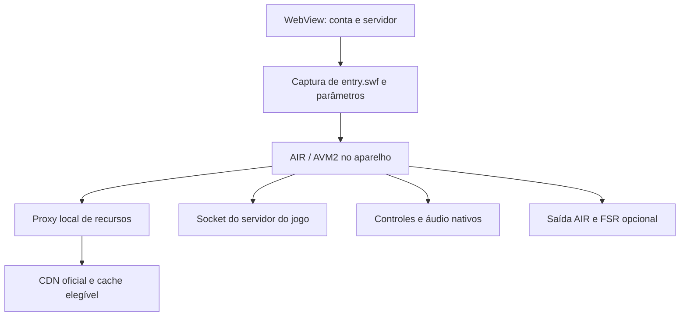

# Naruto Online Mobile

**Cliente Android comunitário para executar o cliente Flash de Naruto Online BR no próprio celular, com login pelo portal, controles de toque e uma camada de compatibilidade AIR/AVM2.**

Mantido por **W1/W2 Soluções Capitais**. Documentação da base **1.3.16**, revisada em **4 de outubro de 2026**.

| Produto | Plataforma | Código publicado | Situação |
| --- | --- | --- | --- |
| Naruto Online Mobile | Android 7.0+, ARM64 | Camada mobile, adaptadores, transporte, filtros e testes | Experimental; funcionamento relatado pelo usuário, sem certificação em todos os aparelhos |

> Este é um cliente não oficial. O projeto não contém o código-fonte completo de Naruto Online, não é um servidor privado e não é endossado pela Oasis Games, Tencent, Bandai Namco, AMD ou NVIDIA. A camada própria publicada tem licença MIT; o jogo, o runtime AIR e os recursos de terceiros têm direitos e condições separados. A ponte nativa histórica ainda possui uma dependência sem fonte disponível, descrita abaixo.

**Links:** [Código](https://github.com/W2CAPITAL/Naruto-online-mobile-) · [Problemas e sugestões](https://github.com/W2CAPITAL/Naruto-online-mobile-/issues) · [W1](https://github.com/W1CAPITAL) · [W2](https://github.com/W2CAPITAL) · [Suporte no WhatsApp](https://wa.me/5513991199349)

## Índice

- [O que é, exatamente](#o-que-é-exatamente)
- [Requisitos mínimos e compatibilidade](#requisitos-mínimos-e-compatibilidade)
- [Instalação e primeiro acesso](#instalação-e-primeiro-acesso)
- [Funcionalidades e configurações](#funcionalidades-e-configurações)
- [Arquitetura e execução do jogo](#arquitetura-e-execução-do-jogo)
- [FPS, fluidez, cores e upscaling](#fps-fluidez-cores-e-upscaling)
- [FSR, DLSS e geração de quadros](#fsr-dlss-e-geração-de-quadros)
- [Kaguya: alcance do port](#kaguya-alcance-do-port)
- [Música, efeitos e áudio](#música-efeitos-e-áudio)
- [Rede, cache e carregamento](#rede-cache-e-carregamento)
- [Contas, servidores e recarga](#contas-servidores-e-recarga)
- [Segurança, privacidade e permissões](#segurança-privacidade-e-permissões)
- [O que está aberto e o que falta](#o-que-está-aberto-e-o-que-falta)
- [Estrutura do repositório](#estrutura-do-repositório)
- [Ambiente de desenvolvimento e build](#ambiente-de-desenvolvimento-e-build)
- [Testes e nível de validação](#testes-e-nível-de-validação)
- [Diagnóstico de problemas](#diagnóstico-de-problemas)
- [Contribuição e roteiro](#contribuição-e-roteiro)
- [Licenças, créditos e suporte](#licenças-créditos-e-suporte)

## O que é, exatamente

Naruto Online Mobile adapta para Android o caminho de acesso de um jogo que utiliza um cliente Flash/ActionScript 3. O aplicativo reúne uma WebView nativa para o portal e um runtime AIR incorporado para executar o cliente AVM2. O processamento do cliente acontece no aparelho; autenticação, personagens, combate persistente e demais serviços continuam dependendo dos servidores do jogo.

A parte desenvolvida neste projeto faz a ligação entre esses ambientes: captura a entrada correta do cliente, conserva os parâmetros de lançamento, resolve caminhos de recursos, adapta referências incompatíveis com AIR mobile, fornece entrada por toque e acompanha o ciclo de vida do aplicativo.

O APK não transforma o jogo em uma versão independente. Ele precisa de internet, acesso ao portal e uma sessão válida. Também não oferece acesso a contas, itens, moedas, personagens ou privilégios que o servidor original não autorize.

### O que o produto entrega

- Acesso ao portal brasileiro, seleção manual de conta e servidor e passagem para o cliente real.
- Execução local de SWF/AVM2 com runtime AIR incorporado ao APK.
- Teclado, mouse virtual, toque, indicação de clique e controles móveis.
- Meta de 60 FPS por padrão, com taxas superiores escolhidas pelo usuário.
- Perfil fixo de cores e redução da resolução interna com ampliação da imagem.
- FSR 1 espacial experimental, opcional, com EASU/RCAS na GPU.
- Um port cosmético parcial de recursos Kaguya quando os recursos autorizados estão presentes no pacote.
- Acesso à recarga oficial e ferramentas para trocar conta/servidor sem reaproveitar o cliente antigo.
- Código público da camada própria para estudo, revisão e contribuição.

### O que ele não entrega

Não há streaming remoto do jogo, Ruffle, emulação de Windows, servidor privado, modo offline, DLSS, geração de quadros intermediários ou garantia de FPS constante. O código do jogo original não se torna aberto por ser carregado pelo aplicativo. Também não há integração completa do remaster Kaguya de Windows.

## Requisitos mínimos e compatibilidade

Os requisitos abaixo separam **restrições reais do pacote** de fatores de desempenho ainda sem medição suficiente. Um aparelho que permite instalar o APK pode continuar sem conseguir sustentar uma sessão fluida.

### Requisitos confirmados da base 1.3.16

| Item | Requisito | Como foi determinado |
| --- | --- | --- |
| Sistema | Android **7.0 ou superior**, API 24+ | `minSdkVersion=24` no descritor |
| Arquitetura | **ARM64 / arm64-v8a**, com Android de 64 bits | Build `Android-ARM64`, ADT `-arch armv8` |
| Portal | WebView funcional, JavaScript e cookies disponíveis | Fluxo nativo de login e sessão |
| Rede | Internet e acesso permitido aos domínios do portal, autenticação, CDN e servidor | O cliente depende de serviços externos |
| Conta | Conta válida aceita pelo portal utilizado | O aplicativo não fornece autenticação independente |
| Gráficos básicos | Runtime AIR e renderização compatíveis com os drivers do aparelho | Perfil mobile, modo `direct`, aceleração de hardware |
| Armazenamento | Espaço para instalar o APK/runtime e os dados/cache da sessão | O arquivo APK sozinho não representa a ocupação instalada |
| Orientação | Uso em modo paisagem | Descritor do aplicativo |

**Processador ARM64 com Android de 32 bits não satisfaz o requisito.** O APK desta base não inclui ARMv7, x86 ou x86_64. Não existe uma compilação iOS neste repositório.

O alvo declarado é **API 35**. Isso não exige Android 15: `targetSdkVersion` e `minSdkVersion` têm funções diferentes. Também não significa que cada versão, fabricante ou driver foi testado.

### RAM, CPU, GPU e espaço: o que ainda não foi certificado

Não há um mínimo numérico de RAM, frequência de CPU, modelo de GPU ou tamanho total instalado validado por uma matriz de aparelhos. Por isso, o projeto **não promete que 2 GB, 3 GB, 4 GB ou qualquer outro número seja suficiente**. Memória disponível para o processo, temperatura, resolução da tela, driver e recursos carregados na cena influenciam o resultado.

O APK 1.3.16 de referência tem **12.763.154 bytes, aproximadamente 12,17 MiB**. O cache estático próprio tem teto de **64 MiB**, mas esse teto não inclui WebView, memória de SWF, texturas, áudio nem todos os dados privados do aplicativo. Não se deve usar 64 MiB como requisito de armazenamento total ou de RAM.

Para validar um aparelho, registre RAM total, RAM disponível, modelo do SoC, versão do Android, WebView, resolução e taxa da tela. Teste login, carregamento, batalha, menus com muitos ninjas, áudio, recarga e retorno do segundo plano. Só depois de testes repetidos é possível estabelecer um perfil mínimo de desempenho confiável.

### Requisitos adicionais do FSR experimental

O FSR não é necessário para entrar no jogo. A opção exige um contexto **OpenGL ES 3.0**, caminho EGL14 funcional e suporte dos drivers às operações utilizadas. A integração limita a saída a **8.388.608 pixels** e respeita o tamanho máximo de textura informado pela GPU.

Uma GPU que anuncia ES 3.0 ainda pode apresentar problemas específicos de driver ou de composição de Surface. A rotina deve retornar à saída AIR normal quando a saída FSR não inicia ou perde suas condições de funcionamento.

### Situação da compatibilidade

| Plataforma/aparelho | Situação |
| --- | --- |
| Aparelho Android usado nos relatos de desenvolvimento | O usuário relatou entrada no jogo e uso dos controles; isso não constitui benchmark completo |
| Outros Android ARM64, API 24+ | Elegíveis pelo pacote; funcionamento e desempenho precisam ser verificados |
| Android abaixo de 7.0 | Fora do mínimo declarado |
| Android ARM de 32 bits | Não atendido por este APK |
| Emuladores x86/x86_64 | Sem build específico; tradução ARM, quando existente, não foi validada |
| iPhone/iPad | Sem suporte neste projeto |
| PC com Magpie | É outra plataforma e outra integração; não é a execução deste APK |

O nome histórico `RealmeC71` nos artefatos não restringe o aplicativo a esse modelo, nem certifica compatibilidade com todos os celulares.

## Instalação e primeiro acesso

1. Obtenha o APK publicado pelo mantenedor e confira versão, origem e integridade.
2. Confirme Android API 24+ e suporte a `arm64-v8a` pelo sistema, além do hardware.
3. Faça a instalação pelo mecanismo padrão do Android. Atualizações devem conservar a assinatura do aplicativo instalado.
4. Abra em paisagem e entre na sua conta pelo portal. A sessão salva pode conservar o login entre aberturas.
5. Escolha o servidor desejado. Aguarde os recursos centrais e a entrada do cliente.
6. Abra **CONTROLES**, reposicione o botão e configure toque, mouse e teclado conforme a necessidade.
7. Comece com a meta padrão de 60 FPS e FSR desligado. Compare o comportamento antes de ativar opções mais exigentes.

Não é necessário instalar um plugin Flash separado: o APK utiliza um runtime incorporado. Isso não elimina a dependência do portal nem as condições de uso do runtime.

### Artefato de referência

| Campo | Valor |
| --- | --- |
| Versão | `1.3.16` |
| versionCode verificado | `1003016` |
| Pacote | `air.br.davi.narutoair.c71r2` |
| Arquivo histórico | `NarutoOnline_RealmeC71_1.3.16.apk` |
| Assinatura | APK Signature Scheme v2 verificado na geração |
| SHA-256 do APK | `ab3ee88e9147a8815e32a894c13a5ec405291847904cf52d345c37ae9425c49d` |
| SHA-256 do certificado | `1b4b528b92aa1ea13753798cbb701d66589333f7b2d8afb3a750aa1c83642c29` |

Esses identificadores descrevem um artefato específico. Uma recompilação com outra chave ou conteúdo terá hashes diferentes. Esta publicação de código/documentação não cria, por si só, uma GitHub Release nem hospeda esse APK no repositório.

## Funcionalidades e configurações

| Recurso | Comportamento da base | Observação |
| --- | --- | --- |
| Login | Sessão do portal; sem registro automático de convidado no fluxo atual | A conta já salva pode permanecer autenticada |
| Servidores | Seleção manual e descarte do cliente anterior | Não deve fixar silenciosamente a conta ou o servidor antigo |
| CONTROLES | Botão flutuante arrastável, com posição salva | Elementos de interface do jogo variam conforme a tela |
| Mouse virtual | Touchpad, cursor e suporte a clique/arrasto | É entrada para o cliente, não um mouse global do Android |
| Teclado | Entrada Android e atalhos Enter/Esc/Tab | Comportamento depende do campo e do foco do jogo |
| Marca de clique | Feedback visual configurável | Não substitui o recebimento do evento pelo cliente |
| FPS | HUD discreto, reposicionável entre cantos e ocultável | Sem bloquear a entrada do jogo |
| Meta de FPS | 60 padrão; 90/120/máxima mediante escolha | Taxa selecionada é preferência, não desempenho garantido |
| Cores | Ajuste moderado de contraste ativo no perfil | Não altera os assets originais no servidor |
| Ampliação básica | Escala interna de 80%, quando suportada | Retorno à superfície adequada ao cliente quando necessário |
| FSR 1 | Opcional, experimental e desligado a cada abertura | A seleção não é persistida como padrão obrigatório |
| Kaguya | Liga/desliga e estilo salvos | Exige os recursos do mod autorizados no pacote |
| Som | SOM ON/OFF salvo; TESTAR SOM local | Volume do Android e opções internas do jogo continuam relevantes |
| Recarga | Abertura do fluxo oficial da sessão | Nenhuma compra é realizada automaticamente |
| Identificação | Copyright e links de suporte no portal | O rodapé some ao entrar no cliente |
| LOG/DIAG | Botões removidos da interface de produção | Instrumentação no fonte não implica um botão visível |

## Arquitetura e execução do jogo



### 1. Portal e sessão

A WebView apresenta o portal e participa do fluxo de login. A camada mobile conserva a sessão e aceita a janela do jogo quando o portal abre o servidor em popup. O cliente só deve iniciar depois de identificar a URL versionada real do SWF; um placeholder genérico `/entry.swf` não é prova de que o cliente final foi resolvido.

Os parâmetros de URL e FlashVars são transportados para o ambiente AIR. A camada de lançamento evita depender da URL dinâmica `app:/.../[[DYNAMIC]]/...` para resolver recursos relativos, pois essa URL não representa o diretório do cliente no CDN.

### 2. Proxy local

O aplicativo abre um servidor HTTP em **loopback `127.0.0.1`**, com porta escolhida durante a execução. O cliente solicita recursos por essa origem local e a ponte resolve os caminhos permitidos para o transporte remoto ou para a substituição cosmética local.

Esse proxy fica dentro do aparelho. Ele não significa que o jogo é executado em uma máquina remota, não fornece um proxy público e não é uma promessa de contornar bloqueios do portal. A porta muda entre sessões e não deve ser gravada como endpoint permanente.

### 3. Adaptação de SWF

`EntryCompatibility` examina o SWF e referências no bytecode ABC. Referências específicas de navegador são encaminhadas para classes compatíveis com o ambiente AIR, incluindo carregadores, resolução de recursos, ExternalInterface, Security, menus, sockets e som.

O cliente continua contendo seu bytecode e recursos originais, sujeitos aos direitos de seus titulares. A finalidade dos adaptadores é permitir execução no ambiente mobile, não substituir autenticação, inventário, combate ou regras do servidor.

O carregamento usa `loadBytes` com importação de código no contexto configurado. SWF inicializado não significa que o jogo já terminou de baixar configurações, plugins, texturas ou dados do servidor.

### 4. Ciclo de vida

Ao trocar conta/servidor ou encerrar o cliente, a camada mobile precisa interromper downloads pendentes, fechar conexões, retirar objetos antigos do Stage e encerrar áudio. O estado antigo não pode continuar respondendo a eventos depois que uma sessão nova passa a ser ativa.

O retorno do segundo plano também exige cuidados: Surface, foco, fila de importação e saída FSR não devem ser considerados válidos apenas porque existiam antes de pausar o aplicativo.

## FPS, fluidez, cores e upscaling

### Meta de 60 FPS não é garantia de 60 imagens novas

O perfil pede `Stage.frameRate=60` como padrão. Uma preferência explícita permite 90, 120 ou a taxa máxima selecionável da tela. A rotina também procura corrigir alterações de limite feitas pelo cliente, mas não cria capacidade de CPU/GPU que o aparelho não possui.

Há pelo menos três medidas diferentes:

| Medida | Significado | O que não prova |
| --- | --- | --- |
| FPS alvo | Cadência solicitada ao Stage | Que o aparelho sustentou essa taxa |
| FPS AIR do HUD | Frequência observada de callbacks `ENTER_FRAME` | Que cada callback gerou uma imagem visual nova ou foi apresentado fisicamente |
| Saídas/swap FSR | Chamadas processadas/apresentadas pelo caminho FSR | Quadros intermediários, simulação nova ou benchmark do compositor Android |

Um contador de 60, 90 ou 120 sozinho não certifica fluidez real. Medidas de frame time e apresentação no aparelho são necessárias para caracterizar quedas, repetições e latência.

### Por que o jogo pode parecer em 2×

Partes do cliente Flash podem avançar por frame script em vez de tempo decorrido. Aumentar a cadência de aproximadamente 30 para 60 pode acelerar essas partes. O projeto ainda não separa de forma geral os ticks da lógica da apresentação.

Preservar essa sensação de aceleração não equivale a produzir quadros extras por interpolação. Corrigir a velocidade exigiria identificar relógios, temporizadores, animações e dependências do cliente, preservando o protocolo de rede.

### Perfil visual atual

O perfil mantém qualidade AIR `medium`, contraste moderado e tenta usar largura e altura internas a **80%** da saída. Quando essa redução se aplica, a área de pixels cai para `0,8 × 0,8 = 64%`, uma redução de aproximadamente **36%** na quantidade de pixels da superfície. Isso não é uma promessa de 36% a mais de FPS: bytecode, rede, áudio, importação e composição também custam tempo.

As coordenadas de entrada devem acompanhar a superfície efetivamente aplicada. O aplicativo não deve ampliar a imagem e continuar tratando toques como se não houvesse escala. Caminhos incompatíveis, incluindo particularidades de Stage3D/superfície, precisam conservar a saída funcional do cliente.

### Medidas de estabilidade já presentes

- Dois downloads de SWF simultâneos, evitando disparar todas as importações juntas.
- Importação de um SWF por `ENTER_FRAME`, com adiamento limitado quando o frame anterior está acima do orçamento.
- Marca de pressão de 8 MiB na fila de bytes para reduzir a abertura de novas cargas.
- Pausa de processamento da fila no segundo plano.
- Cache estático limitado para diminuir transferências repetidas elegíveis.
- Limpeza de recursos e áudio ao abandonar uma sessão.
- FSR fora do caminho padrão, com retorno à saída AIR quando falha.

A marca de 8 MiB não é um teto absoluto de memória: downloads já iniciados podem terminar depois dela. A importação nativa de um SWF também pode bloquear um frame; ela não se torna interrompível por ser colocada em fila. Por isso, cenas pesadas ainda podem apresentar quedas.

## FSR, DLSS e geração de quadros

### O que foi implementado

A base utiliza kernels FP32 do **AMD FidelityFX Super Resolution 1**, com wrappers para **OpenGL ES 3.0**. São dois passes espaciais:

1. **EASU** reconstrói/amplia a imagem de menor resolução considerando bordas.
2. **RCAS** aplica nitidez adaptativa à saída ampliada.

O hook ocorre antes do swap EGL14 do AIR. O caminho copia o framebuffer na GPU, processa os passes e apresenta a saída em outra Surface usando o contexto previsto pela integração. O caminho de produção não depende de capturar screenshots e processá-las na CPU.

O estado GL/EGL precisa ser restaurado ao retornar ao AIR. O swap original é preservado. Há tratamento de ausência de saída, recursos inválidos e destruição de superfície; após aproximadamente quatro segundos sem início de frames FSR, a rotina oferece fallback.

### O que não foi implementado

| Tecnologia | Situação |
| --- | --- |
| Ampliação básica de superfície | Presente no perfil mobile |
| FSR 1 EASU/RCAS | Presente, opcional e experimental |
| FSR temporal / FSR 2 | Não implementado |
| FSR Frame Generation | Não implementado |
| Interpolação por fluxo óptico | Não implementada |
| DLSS, incluindo geração de quadros | Não implementado |
| Magpie Windows dentro do APK | Não incorporado |
| Quadros duplicados para inflar o HUD | Não utilizados como recurso de desempenho |

FSR 1 trabalha sobre uma imagem existente. Ele não acrescenta estados novos da simulação nem fornece vetores de movimento ou profundidade. O hook de framebuffer não torna disponíveis automaticamente os dados que uma integração temporal exige.

O cliente Flash não expõe à ponte atual um pipeline geral de profundidade, vetores de movimento e tratamento separado de HUD. Uma geração de quadros séria exigiria outra implementação, histórico, sincronização, avaliação de artefatos, latência e custo de GPU.

DLSS depende de integrações e hardware do ecossistema NVIDIA; não há biblioteca DLSS executável disponível nesta ponte AIR Android. Magpie é um projeto de Windows e seus filtros não tornam seu executável utilizável como um componente Android.

### Validação e custo

Os shaders foram compilados e executados em **Mesa llvmpipe**, um backend de software, incluindo comparação do adaptador de amostragem, cores constantes, orientação e cópia GPU. Isso testa resultados e operações do shader naquele ambiente; **não mede desempenho em uma GPU Android**.

Não há benchmark publicado deste FSR em Adreno, Mali ou outras GPUs de celular. EASU, RCAS, texturas e composição têm custo: a opção pode melhorar a aparência e reduzir FPS. Ela começa desligada a cada abertura para evitar transformar um caminho experimental em requisito de acesso ao jogo.

Proveniência: [fsr/PROVENANCE.json](fsr/PROVENANCE.json). Licença AMD: [fsr/NOTICE.txt](fsr/NOTICE.txt). Detalhes: [FRAME_GENERATION_STATUS.md](FRAME_GENERATION_STATUS.md) e [MAGPIE_STATUS.md](MAGPIE_STATUS.md).

## Kaguya: alcance do port

O material de origem foi o pacote `Naruto_Kaguya_Remaster_Portable.zip`, fornecido durante o desenvolvimento. As instruções indicam **Herrington Kaguya** como autor. O port mobile reutiliza um subconjunto conhecido de recursos, sem executar ou incluir os programas Windows do pacote original.

### Subconjunto integrado na distribuição com os assets

| Tipo | Quantidade/alcance | Limite |
| --- | --- | --- |
| Estilos | Vento, Fogo, Raio, Água e Terra | Escolha cosmética; não troca a classe no servidor |
| Retratos PNG | 10: dois por estilo, 176×68 e 45×45 | Apenas caminhos e aparências explicitamente reconhecidos |
| IDs atendidos | `10000101` a `10000501`, aparência `1` | Não é uma substituição geral de todos os ninjas |
| Sons SWF | 15, com exportação `s1` | Substituição apenas do mesmo nome solicitado pelo cliente |
| Preferências | Ativação e estilo salvos | Retorno ao transporte oficial em recursos não atendidos |

Os nomes dos sons são `s1754`, `s1790`, `s1791`, `s1792`, `s17661` a `s17670` e `s17676`. O manifesto registra origem e SHA-256 de cada recurso.

As pastas grandes **BGM/Animation effect já estavam ausentes no pacote recebido**. Portanto, este port não entrega uma trilha completa Kaguya. Outros SWF antigos, interfaces, personagens, imagens e animações do remaster não foram integrados de forma geral ao cliente BR atual.

### Código público versus mídia do mod

O repositório publica o roteador, controles, testes e manifesto. **Os 25 arquivos de mídia do mod não são republicados nesta abertura de código**, porque a licença da camada própria não concede direitos sobre eles. Testes e empacotamento que dependem desses arquivos exigem uma cópia autorizada no caminho correspondente.

O ReadMe original indica gratuidade e proíbe obter benefícios com o software. Esses termos não são substituídos por MIT. O APK e o material do mod precisam respeitar as condições dos respectivos titulares. Consulte [KAGUYA_STATUS.md](KAGUYA_STATUS.md) e [THIRD_PARTY_NOTICES.md](THIRD_PARTY_NOTICES.md).

O mod não altera saldo, servidor, conta, inventário ou regras de combate.

## Música, efeitos e áudio

A base 1.3.16 introduz `BrowserSound`, que mantém a execução de som nativa e resolve URLs de áudio para o transporte de recursos. Referências de classes Sound são adaptadas sem substituir amostras MP3, símbolos ou eventos por áudio artificial.

`AudioSession` utiliza o modo de áudio de mídia, oferece **SOM ON/OFF** persistido e encerra canais/streams ao abandonar o cliente. **TESTAR SOM** gera um tom PCM curto, de aproximadamente 0,25 segundo e baixo volume, para verificar a saída nativa sem depender de rede ou do mod.

Existem três controles distintos: volume de mídia do Android, estado SOM do aplicativo e volumes/categorias do próprio jogo. Um deles silenciado pode impedir a reprodução mesmo quando o recurso foi baixado corretamente.

Os 15 MP3 do subconjunto Kaguya foram decodificados para PCM não silencioso; comprimentos, símbolos e bytecode foram conferidos em verificações independentes. Isso confirma integridade dos arquivos analisados, **não confirma que a reprodução final foi ouvida em um Android**.

Nesta validação, não houve reprodução integral do cliente no aparelho e uma consulta ao CDN oficial retornou 403. A correção de áudio está implementada, mas a causa de todo silêncio relatado no aparelho ainda não foi reproduzida e encerrada experimentalmente.

Se TESTAR SOM funcionar e o jogo continuar silencioso, a investigação deve avançar para categorias de áudio, caminhos, respostas da rede, criação do Sound e início do SoundChannel. Se o teste local também não funcionar, verifique primeiro a saída de mídia e o ciclo de vida da sessão. Não se deve concluir que há uma trilha Kaguya ausente apenas porque os efeitos do mod foram integrados.

## Rede, cache e carregamento

### Transporte e proteção contra caminhos errados

O transporte resolve recursos a partir da base correta do cliente e restringe operações/caminhos esperados. Uma requisição para `app:/resource.cfg` ou para um diretório raiz errado não é equivalente ao arquivo versionado no CDN. Esse cuidado foi necessário para evitar 404 e falhas de inicialização nos adaptadores.

Há compatibilidade com endpoints legados do jogo que utilizam HTTP. O manifest permite tráfego claro; portanto, não é correto descrever toda a comunicação do aplicativo como HTTPS de ponta a ponta.

### Cache estático próprio

| Regra | Valor/condição |
| --- | --- |
| Orçamento total | 64 MiB |
| Limite de arquivos | 512 |
| Máximo por recurso cacheado | 8 MiB |
| TTL máximo | Uma hora, limitado pelas condições de cache |
| Candidatos | PNG/JPEG/SWF elegíveis em caminhos versionados |
| Resposta | GET 200, tamanho positivo, tipo válido e política apropriada |
| Exclusões | Consultas, Range, Set-Cookie, Vary, private/no-store e respostas comprimidas não elegíveis |

Substituições do mod são avaliadas antes do cache e não devem contaminar os recursos oficiais. O Android pode remover arquivos de cache. Configurações de sessão e respostas personalizadas não devem ser tratadas como mídia estática compartilhável.

Esse cache reduz transferências repetidas em casos elegíveis; não permite jogar offline e não representa um espelho completo do CDN.

### Conexão com o servidor

`BrowserSocket` mantém o transporte nativo, bytes e flush utilizados pelo cliente. A instrumentação pode contar conexão, envio e recebimento, mas não inventa pacotes para forçar avanço do carregamento.

Socket conectado não prova que houve resposta útil. Um travamento em 14% acompanhado de conexão aberta e zero bytes recebidos é um indício de espera na comunicação/etapa seguinte; não basta para afirmar qual lado falhou. Endereço, sessão, primeiro envio, flush e recebimento precisam ser verificados preservando o protocolo original.

## Contas, servidores e recarga

### Conta salva

Cookies e armazenamento do portal podem manter uma conta entre aberturas. Isso é diferente de criar automaticamente um convidado. O fluxo atual deve apresentar acesso e seleção sem substituir a intenção do usuário por uma conta temporária criada silenciosamente.

Ao trocar de conta ou servidor, objetos, conexões e callbacks do cliente anterior devem ser descartados. Um evento atrasado da sessão antiga não deve iniciar o mesmo servidor por cima da seleção nova.

### Recarga

A opção de recarga abre o fluxo oficial usando identificadores disponíveis na sessão atual, como usuário e servidor. O projeto não recebe automaticamente pagamentos, não cria saldo e não altera preços do portal.

A abertura da página e a identificação da sessão são distintas da validação de uma compra real. O checkout completo e os meios de pagamento não foram certificados nesta validação. Confira conta e servidor exibidos no portal antes de concluir uma transação por sua própria ação.

### Bloqueio do portal

O classificador de bloqueio inspeciona o documento principal dos hosts oficiais previstos. Há recarregamento manual limitado a uma tentativa por minuto nas condições de bloqueio/desafio e opção de abrir o portal público no navegador mediante toque.

Uma recuperação de login sem avanço pode realizar uma tentativa limitada após aproximadamente 45 segundos, considerando o estado da navegação/sessão. Não é um laço infinito de login ou recarga.

**O aplicativo não remove regras de Cloudflare e não garante acesso quando o site bloqueia a rede ou a sessão.** Mostrar “Sorry, you have been blocked” continua sendo uma resposta do serviço remoto. A recuperação local não deve ser anunciada como bypass.

## Segurança, privacidade e permissões

### Permissões declaradas pelo aplicativo

| Permissão | Finalidade |
| --- | --- |
| `android.permission.INTERNET` | Portal, autenticação, recursos e comunicação com o jogo |
| `android.permission.ACCESS_NETWORK_STATE` | Consulta do estado de conectividade |

O descritor não solicita contatos, SMS, microfone, acessibilidade, root ou permissão de desenhar sobre outros aplicativos. O botão flutuante pertence à interface do próprio aplicativo.

O manifest também declara `allowBackup=false`, aceleração de hardware e `usesCleartextTraffic=true`. Isso não substitui uma auditoria completa do runtime incorporado ou de todos os endpoints utilizados pelo jogo.

### Dados e serviços externos

O cliente lida com cookies, parâmetros de sessão e preferências locais. O portal e o jogo podem carregar telemetria, conteúdo ou integrações externas próprios. As políticas desses serviços continuam aplicáveis; o código mobile não transforma esses fornecedores em serviços do mantenedor.

Não publique cookies, senhas, tokens, e-mails de contas ou parâmetros completos de autenticação em issues. Mesmo quando um logger mascara valores conhecidos, revise qualquer diagnóstico antes de compartilhá-lo.

O loopback é uma origem interna do aplicativo. Tráfego HTTP legado, carregamento de código externo e dependências proprietárias são pontos que devem permanecer visíveis na análise técnica.

### Play Protect e assinatura

O aviso de que o Play Protect nunca viu um aplicativo desse desenvolvedor não constitui, sozinho, um diagnóstico de malware nem uma certificação de segurança. Assinatura válida comprova integridade/identidade conforme a cadeia usada; não comprova ausência de vulnerabilidades em todo o produto.

Não há garantia de que alterar nome, ícone, target SDK ou recompilar elimine alertas. Este projeto não recomenda desativar a proteção do aparelho. Consulte a origem do APK e as orientações oficiais do Android/Google ao avaliar um alerta.

## O que está aberto e o que falta

**Open code neste projeto significa código público da camada própria.** A licença MIT foi aplicada a essa camada nesta publicação; ela não abrange automaticamente todos os bytes do APK.

| Componente | Fonte público aqui? | Condição |
| --- | --- | --- |
| Bootstrap e adaptadores ActionScript | Sim | MIT, no escopo da camada própria |
| Transporte, cache, ponte complementar e controles Java | Sim | MIT, no escopo da camada própria |
| Scripts de patch/build e testes próprios | Sim | MIT, sem relicenciar suas entradas proprietárias |
| Kernels FSR 1 da AMD | Sim | MIT da AMD, aviso original preservado |
| Wrappers GLES e compositor experimental próprios | Sim | MIT, com atribuição AMD quando aplicável |
| `PortalContext` histórico usado como base | Não, fonte original indisponível | O build depende de `portal.jar` autorizado, não republicado aqui |
| Runtime AIR/HARMAN e SDK | Não | Dependências externas sob suas condições próprias |
| Cliente SWF, assets e servidores Naruto Online | Não | Conteúdo/serviços de terceiros |
| Mídia Kaguya | Apenas manifesto e roteamento | Assets e termos originais separados; mídia excluída desta publicação |
| Chave privada de assinatura e senha | Não | Segredos do mantenedor; nunca devem entrar no repositório |

O repositório permite revisar e modificar uma parte substancial da adaptação. **Ele ainda não permite reconstruir todo o APK a partir de um clone limpo usando somente fontes públicas.** Além do SDK externo, existe uma ponte histórica compilada cuja origem completa precisa ser recuperada ou substituída.

Essa limitação não deve ser escondida sob a expressão “100% open source”. A meta técnica é tornar a ponte totalmente reconstruível, separar claramente dependências e manter testes que comprovem equivalência do comportamento. Veja [SOURCE_STATUS.md](SOURCE_STATUS.md) e [THIRD_PARTY_NOTICES.md](THIRD_PARTY_NOTICES.md).

## Estrutura do repositório

| Caminho | Responsabilidade |
| --- | --- |
| `src/NarutoAir.as` | Bootstrap, cliente AIR e coordenação do ciclo de vida |
| `src/br/davi/narutoair/compat/` | Recursos, loaders, socket, som, entrada e perfil gráfico |
| `bridge-src/` | Integração Android complementar, conta, portal, entrada, marca e Surface |
| `transport-src/` | Proxy, SWF/ABC, cache e roteamento Kaguya |
| `fsr-src/` | Renderização experimental EASU/RCAS |
| `fsr/upstream/` | Headers AMD com direitos preservados |
| `fsr/shaders/` | Shaders gerados para GLES |
| `build-tools/` | Transformações e scripts auxiliares |
| `wrapper-src/` | Marcador usado na geração do SWC da extensão |
| `resource-tests/` | Testes de lógica, JavaScript e shaders |
| `compat-tests/` | Fixtures SWF e validações ABC/áudio |
| `bridge-tests/`, `transport-tests/`, `fsr-tests/` | Testes de classes, transporte, estado e hooks |
| `test-stubs/` | Assinaturas mínimas de teste/compilação; não substituem o Android real |
| `mods/kaguya/manifest.json` | Proveniência dos assets, sem os arquivos de mídia |
| `NarutoAir-app.xml` | Identidade, versão, perfil, permissões e plataforma |
| `build.py`, `test.py` | Pipeline da base, com dependências externas descritas abaixo |

Arquivos compilados, APKs, SDK, chaves, logs locais e mídia de jogo/mod não foram publicados junto com esta abertura de código. A marca pode ser mantida na distribuição do produto; a licença do código não concede direitos sobre personagens ou marcas Naruto.

## Ambiente de desenvolvimento e build

### Ferramentas usadas na base

| Ferramenta | Uso |
| --- | --- |
| Python 3 | Orquestração de build e verificações |
| JDK 17 | Compilação e transformações; classes próprias compiladas com `--release 8` |
| Node.js | Testes de lógica em arquivos `.mjs` |
| AIR SDK `51.1.4.1` | Compiladores AS3, ADT, runtime e bibliotecas de extensão |
| Android `android.jar` API 35 | Compilação das partes Android/GLES |
| JPEXS/FFDec | Verificação independente opcional de SWF/ABC |
| FFmpeg | Validação adicional da decodificação dos MP3 analisados |
| EGL/GLES Mesa | Execução do teste de shader fora de Android |

JDK 17, AIR e API 35 descrevem o ambiente utilizado, não uma promessa de que qualquer combinação de versões produzirá o mesmo pacote. O build transforma bytecode do runtime; uma atualização do SDK deve ser tratada como mudança de integração e novamente validada.

### Dependências que não vêm no clone

Antes de gerar um APK completo, são necessários:

1. AIR SDK obtido por um canal autorizado e usado conforme suas condições.
2. `android.jar` da API 35.
3. Uma base autorizada `portal.jar` contendo as classes históricas esperadas pelo pipeline.
4. Recursos de marca/ícones e, se desejado, assets Kaguya obtidos/licenciados separadamente.
5. Um certificado PKCS#12 e arquivo de senha para assinar a sua distribuição.

O clone público **não contém `portal.jar`**. O pipeline atual não resolve essa ausência baixando binários desconhecidos, nem recompila o `PortalContext` histórico a partir dos stubs. Os stubs servem para compilar/verificar unidades isoladas; não são uma implementação de produção.

### Variáveis de ambiente

```bash
export AIR_HOME="/caminho/para/air-sdk"
export ANDROID_API_JAR="/caminho/para/android-35/android.jar"
export NARUTO_SIGNING_KEY="/caminho/privado/app.p12"
export NARUTO_SIGNING_PASSWORD_FILE="/caminho/privado/senha.txt"
```

Os caminhos são exemplos. Chave e senha devem ficar fora da árvore versionada. Se você não tem a chave original, sua assinatura não atualizará automaticamente o aplicativo assinado pelo mantenedor.

**Somente com as dependências completas e autorizadas disponíveis:**

```bash
python3 build-tools/build-fsr-shaders.py
python3 test.py
python3 build.py
```

`test.py` inclui testes que exigem os assets Kaguya. Em um clone público sem esses arquivos, utilize os testes independentes abaixo ou prepare primeiro uma cópia autorizada dos recursos. Não confunda um teste de arquivo ausente com falha do algoritmo.

O build compila classes próprias, adapta classes históricas, gera SWC/ANE, compila o bootstrap, empacota o runtime e verifica o DEX/assinatura. Ele altera temporariamente a classe EGL14 do SDK e restaura o arquivo no bloco de finalização. Use uma cópia de trabalho do SDK e evite builds concorrentes sobre o mesmo diretório.

### Geração dos shaders

`build-fsr-shaders.py` usa os headers publicados em `fsr/upstream/`. A proveniência e os hashes dessas entradas estão em `fsr/PROVENANCE.json`. Mantenha os avisos AMD no conteúdo derivado e verifique diferenças dos shaders gerados antes de publicar uma alteração.

### Verificação de um APK

Com as ferramentas Android/AIR adequadas, verifique manifesto, ABI, versão e certificado. Exemplos de comandos, ajustando os caminhos:

```bash
sha256sum NarutoOnline_RealmeC71_1.3.16.apk
java -jar "$AIR_HOME/lib/android/lib/apksigner.jar" verify --verbose --print-certs NarutoOnline_RealmeC71_1.3.16.apk
```

A identidade da assinatura é necessária para atualizações. Um hash de arquivo só deve ser comparado ao artefato exato ao qual se refere.

## Testes e nível de validação

### Testes que podem começar sem jogo, mod ou chave

Os testes Node abaixo exercitam lógica própria e fixtures locais. Eles não instalam o aplicativo, não fazem login em uma conta real e não certificam o comportamento dos drivers Android.

```bash
node resource-tests/test-resources.mjs
node resource-tests/test-audio.mjs
node resource-tests/test-launch-parameters.mjs
node resource-tests/test-portal-access.mjs
node resource-tests/test-login-recovery.mjs
node resource-tests/test-load-scheduler.mjs
node resource-tests/test-socket-release.mjs
node resource-tests/test-fps-hud.mjs
node resource-tests/test-fsr-controls.mjs
```

Para executar shaders em um ambiente EGL/GLES Mesa disponível:

```bash
python3 resource-tests/test-fsr-gpu.py
```

Esse teste gera/atualiza `fsr/GPU_VALIDATION.json`. Seu resultado precisa identificar o backend realmente utilizado e conservar `android_device_tested=false` quando não houve teste em um aparelho.

### O que os testes cobrem

| Verificação | Alcance | Limite |
| --- | --- | --- |
| Lógica de portal, controles e sessão | Fixtures e eventos esperados | Não autentica uma conta real |
| Transporte HTTP e cache | Caminhos, respostas e retorno a recursos oficiais em fixtures | Não mede disponibilidade de todos os CDNs |
| SWF/ABC | Referências, tags e preservação estrutural em amostras | Não prova todos os plugins futuros |
| Áudio Kaguya | Integridade e MP3 com PCM não silencioso nos arquivos analisados | Não comprova saída audível no aparelho |
| Shaders EASU/RCAS | Compilação e resultados no Mesa utilizado | Não é benchmark Android |
| Hook e restauração de estado | Testes JVM/bytecode e inspeção de DEX | Não reproduz todos os drivers EGL |
| Assinatura/empacotamento | Validação do artefato gerado | Não equivale a aprovação Google Play |

Existem relatos do usuário de entrada e funcionamento do jogo, com quedas de FPS em determinadas cenas. Eles são úteis como evidência de uso, mas não substituem uma matriz de hardware ou um teste reproduzível de desempenho.

### Protocolo de benchmark proposto

Para comparar duas versões, use o mesmo aparelho, taxa de tela, conta, servidor, cena e estado térmico. Meça separadamente primeiro carregamento e reabertura com cache. Compare FSR desligado/ligado sem trocar as outras opções ao mesmo tempo.

Registre pelo menos duração, FPS do HUD, ferramenta de frame time/apresentação usada, picos de tempo, temperatura, consumo de memória e falhas. Percentis de frame time e ocorrências de travamento são mais úteis para estabilidade do que apenas o maior número de FPS exibido.

Ainda faltam testes sustentados de batalhas, menus pesados, áudio, recarga, mudança de rede, segundo plano, encerramento do processo e retomada em uma seleção ampla de aparelhos.

## Diagnóstico de problemas

| Sintoma | O que conferir primeiro | Limite da conclusão |
| --- | --- | --- |
| APK não instala | Android API 24+, ABI ARM64 do sistema, integridade e assinatura da versão anterior | RAM não explica um conflito de assinatura |
| Alerta Play Protect | Origem do arquivo, certificado e mensagem exata | Recompilar não garante retirar o alerta |
| Página branca | Rede, WebView, recursos de CSS/JS e erros do portal | Não basta para afirmar falha do AIR |
| Cloudflare/403 | URL/host principal, sessão e acesso ao portal pelo navegador | Sem promessa de bypass |
| Conta/servidor anterior reaparece | Cookies e descarte da sessão anterior | Login salvo e convidado automático são situações diferentes |
| Travamento em 14% | Primeiros envios/flush/recebimentos do socket e dados da sessão | Conexão TCP aberta não prova resposta do jogo |
| Travamento em porcentagens posteriores | Recurso pendente, importação SWF, memória e comunicação | O texto do último plugin pode não ser a causa do bloqueio |
| FPS próximo de 30 com alvo 60 | Custo da cena, limite interno, frequência da tela e medição real | O alvo não garante taxa sustentada |
| Animação parece em 2× | Lógica vinculada a frame scripts | Não é evidência de geração de quadros |
| FSR piora desempenho ou mostra imagem incorreta | Desligue a opção e compare a saída AIR; registre GPU/driver | FSR é experimental e pode ter custo maior que o ganho |
| Som não toca | Volume de mídia, SOM ON/OFF, categoria do jogo e TESTAR SOM | MP3 íntegro não garante canal ativo |
| Som Kaguya ausente | Arquivo solicitado, disponibilidade e alcance do subconjunto | Não há BGM completa no material recebido |
| Controle cobre botão | Arraste CONTROLES e ajuste o HUD | Resolução/layout do jogo variam |
| Recarga mostra dados inesperados | Conta e servidor do portal atual | Não prossiga com uma compra baseada em sessão incorreta |

### Informações úteis para uma issue

Inclua versão do aplicativo, modelo exato do aparelho, Android, ABI, WebView, resolução/taxa da tela, passo a passo, duração até falhar, servidor sem credenciais e opções ativas. Informe se ocorre antes do cliente, durante carregamento ou depois de entrar no mapa.

Para áudio, descreva separadamente som oficial, sons do mod e resultado de TESTAR SOM. Para gráficos, inclua FSR ligado/desligado, meta escolhida e comportamento do HUD. Uma captura de tela ajuda, mas não identifica sozinha o motivo de uma queda.

Remova dados de sessão e conta. Senhas, cookies, chaves de assinatura e tokens não devem ser enviados por issue, print ou arquivo de diagnóstico.

## Contribuição e roteiro

Contribuições devem explicar o problema concreto, mudança de comportamento, teste relevante e limites conhecidos. Mantenha alterações pequenas e revisáveis, conserve atribuições de terceiros e não introduza dependências binárias sem origem/condições claras.

Alterações na autenticação, socket ou parâmetros de lançamento precisam preservar o comportamento autorizado do cliente. Não substitua uma resposta ausente por valores fictícios para esconder um travamento. No renderer, mantenha fallback funcional e trate corretamente destruição de superfície e restauração de estado.

### Prioridades técnicas

1. Recuperar ou reimplementar a ponte histórica para permitir build integral da camada mobile a partir de fonte.
2. Criar uma matriz de compatibilidade e requisitos de desempenho medidos por aparelho.
3. Confirmar o áudio oficial e Kaguya em Android, isolando recurso, canal e saída nativa.
4. Medir frame time e estabilizar importações/cenas pesadas antes de prometer metas superiores.
5. Avaliar a separação entre velocidade da lógica e apresentação, preservando animações/protocolo.
6. Validar FSR em GPUs reais e manter a opção desativada quando o custo não compensa.
7. Completar cenários de retomada, troca de conta/servidor e recarga com testes de integração.
8. Ampliar o mod somente com recursos autorizados e mapeamento comprovado para o cliente atual.

Esses itens são direção de desenvolvimento, não promessa de prazo ou recursos já entregues. Geração de quadros permanece pesquisa futura, sem implementação anunciada neste produto.

## Licenças, créditos e suporte

### Código próprio

Copyright © 2026 **W1/W2 Soluções Capitais**. A camada própria publicada está sob [licença MIT](LICENSE), respeitadas as exclusões e atribuições em [THIRD_PARTY_NOTICES.md](THIRD_PARTY_NOTICES.md). O produto experimental é disponibilizado sem garantia de desempenho ou compatibilidade universal.

### Terceiros

Naruto, Naruto Online, personagens, logotipos, jogo e respectivos assets pertencem aos seus titulares. A utilização do nome descreve o cliente ao qual esta adaptação se destina; não estabelece parceria oficial.

AIR/HARMAN/Adobe têm termos próprios. Os kernels FSR 1 mantêm a licença MIT e copyright AMD. Kaguya mantém autoria e condições originais. A licença deste repositório não autoriza redistribuição irrestrita desses componentes.

### Contato

- GitHub W1: [github.com/W1CAPITAL](https://github.com/W1CAPITAL)
- GitHub W2: [github.com/W2CAPITAL](https://github.com/W2CAPITAL)
- Suporte: **(13) 99119-9349** — [WhatsApp](https://wa.me/5513991199349)
- Relatos técnicos: [Issues do projeto](https://github.com/W2CAPITAL/Naruto-online-mobile-/issues)

No aplicativo, copyright e links aparecem antes da entrada no cliente e o rodapé some durante o jogo para preservar a área de interação.

### Referências técnicas

- [Android: minSdkVersion e targetSdkVersion](https://developer.android.com/guide/topics/manifest/uses-sdk-element)
- [Android: ABIs e arm64-v8a](https://developer.android.com/ndk/guides/abis)
- [AIR SDK e documentação](https://airsdk.dev/)
- [AIR Stage.frameRate](https://airsdk.dev/reference/actionscript/3.0/flash/display/Stage.html)
- [AMD FidelityFX-FSR: código e licença](https://github.com/GPUOpen-Effects/FidelityFX-FSR)
- [AMD FSR e tecnologias relacionadas](https://gpuopen.com/fidelityfx-superresolution/)
- [NVIDIA DLSS](https://developer.nvidia.com/rtx/dlss)
- [Magpie](https://github.com/Blinue/Magpie)
- [Definição de open source da OSI](https://opensource.org/osd)

Os dados de comportamento desta documentação são derivados da base publicada e das verificações descritas. Documentação externa fundamenta a plataforma; ela não certifica este aplicativo.
